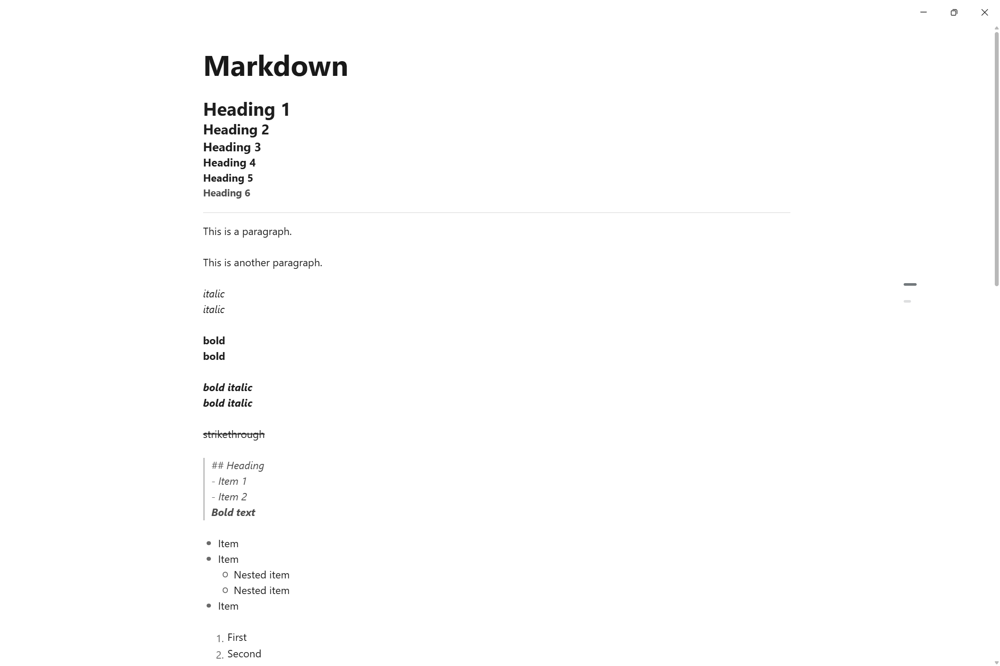
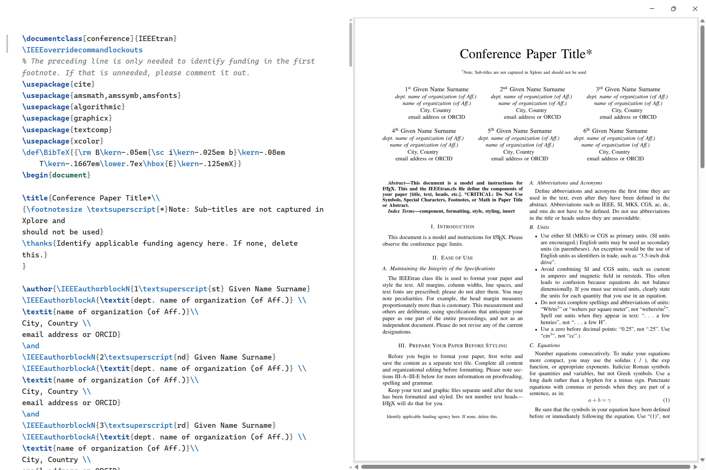

<p align="center">
    
    <br/>
    <h1 align="center">Glyph</h1>
    <p align="center">A lightweight, minimalistic cross-platform document editor.</p>
    <br/>
</p>

Glyph is a focused desktop editor built with [Wails v3](https://v3.wails.io/), Go, TypeScript, and Vite. It is designed for local-first writing with Markdown editing, source document support, native file dialogs, and a quiet frameless desktop interface.

# Features
- Edit Markdown documents with rendered inline formatting.
- Open and save local files through the desktop file system.
- Browse an opened directory with the built-in file tree.
- Find and replace text with match case and whole word options.
- Export Markdown documents to PDF through the print flow.
- Edit LaTeX in a split source/PDF preview view, with PDF compilation triggered when the document is saved.
- Preview LaTeX PDF output when a generated PDF is available.
- Restore the last opened document and autosave changes.

# Screenshots




# Quickstart
## Requirements
- Go
- Node.js and npm
- [Wails v3 CLI](https://v3.wails.io/)

## Run in Development
Install dependencies and start the desktop app in development mode:
```sh
wails3 dev
```

## Build a Binary
Build a production desktop binary for the current platform:
```sh
wails3 build
```

## Package the App
Package the app for the current platform:

```sh
wails3 package GOOS=windows
wails3 package GOOS=darwin
wails3 package GOOS=linux
```

# License
This project is licensed under the terms of the [MIT License](LICENSE).
